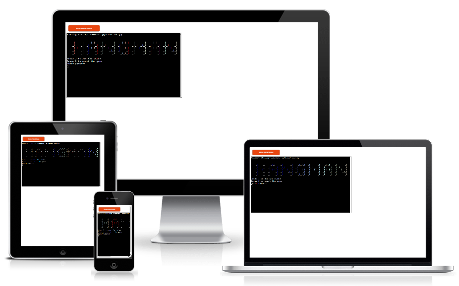

# Hangman
Hangman is a Python Terminal game. Users can try to guess the word by inputting letters until they guess the word and win or lose the game by running out of tries. 
You can read more about the game <a href = "https://en.wikipedia.org/wiki/Hangman_(game)" target="_blank" rel="noopener">here</a>.

<a href = "https://nelas-hangman.herokuapp.com/" target="_blank" rel="noopener">Click here</a> to try out the game. 

### How to play:
* Start by choose either reading the rules or start the game.
* When player start the game, the program randomly chooses one word from the list with 300 different words.
* The word is represented with underscores to show how many letters are in the word.
* If the letter is correct, the underscore will be replaced with the correct letter.
* If the letter is wrong, the player will lose a "live" until there is zero lives left. The player gets 6 tries.
* The player wins when the word is guessed and loses if the lives runs out. 
* If the player wins/loses, the menu will start over. 

### Wireframes/FlowChart

During the planning proccess I made a Flowchart to set the basic steps to help guide my coding process. 
As the game is played in the terminal, no wireframes is made for a visual look. 

### Design

The game is very limited because of it is played trough the terminal. 
More information about future design is written under [Future Features](#future-features)

